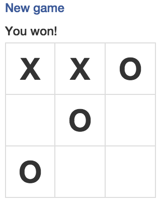

Tictactoe web game - Demo for Akka and Xitrum

See slides: `Develop realtime web with Scala and Xitrum <http://www.slideshare.net/ngocdaothanh/develop-realtime-web-with-scala-and-xitrum>`_

Requirement: Java 7+

Development mode
----------------

Run:

::

  sbt/sbt run

Open http://localhost:8000/ or https://localhost:4430/

To generate Eclipse or IntelliJ project:

::

  sbt/sbt eclipse
  sbt/sbt gen-idea

Production mode
---------------

Package:

::

  sbt/sbt xitrum-package

Directory ``target/xitrum`` will be created:

::

  target/xitrum/
    config/
      akka.conf
      xitrum.conf
    lib/
      <jar files>
    script
      start
      start.bat

Clustering
----------

You can run a cluster of Tictactoe servers.
See "Single node" and "Clustering" in Lobby.scala and Player.scala.
Use akka.conf to config the cluster.

How this program works
----------------------

Player matching
~~~~~~~~~~~~~~~

* Player actors connect to a lobby actor.
* When there are enough 2 players, the lobby actor let the player actors know
  about each other.
* The players then send messages directly to one another.

::

  browser1 --- [SockJs] --- player actor1
                                |
                            lobby actor
                                |
  browser2 --- [SockJs] --- player actor2

Game playing
~~~~~~~~~~~~

::

  browser1 --- [SockJs] --- player actor1
                                |
                                |
                                |
  browser2 --- [SockJs] --- player actor2

Exercises
~~~~~~~~~

* Instead of letting player actors send messages directly to each other, use
  an intermediate game actor for each game.
* Let users other than the players watch games.
* Use `Scala.js <http://www.scala-js.org/>`_ to convert game logic code written
  in Scala to JavaScript, to share game logic code between server side and
  client side.
* Use Akka FSM instead of ``become``.
